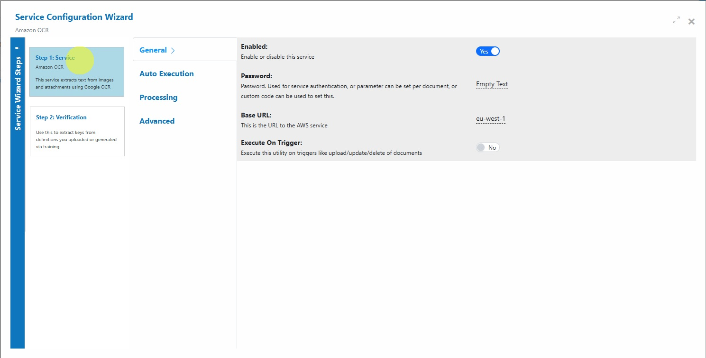

# Amazon OCR

### Overview

The **Amazon OCR Service** in AIForged uses Amazon Textract to extract raw text from documents, without preserving layout information. The extracted text is stored in the **Result** property of the document for downstream processing, analysis, or integration.


Use this service when you need plain text extraction from images or PDFs for workflows such as data mining, regex pattern detection, and downstream AI processing.


***

### Supported Content Types

* PDF
* JPEG
* PNG


If your content is in a different format, use the AIForged PDF Converter to generate a compatible file.


***

### Possible Use Cases

* Extract text from scans of receipts, invoices, or contracts.
* Run **RegEx patterns** on extracted text to detect keywords or structured data.
* Prepare training datasets for machine learning by extracting plain text.
* Index documents for search functionality.

***

### Service Setup

Follow these steps to add and configure the **Amazon OCR Service** to your agent:

1. **Open the Agent View**\
   Navigate to the agent where you want to add the service.
2. **Add the Amazon OCR Service**\
   Click the **Add Service**  button.
3. **Select Service Type**\
   Choose **Amazon OCR Service** from the available service types.\
   
4. **Configure the Service Wizard**\
   Open the Service Configuration Wizard.\
   \
   or\
   
   * **Step 1: General Settings**\
     Configure core OCR settings such as service name and description.\
     &#xNAN;_&#x44;efault settings are sufficient for most use cases._\
     
   * **Step 2: Verification**\
     No verification is typically required for text extraction services unless paired with downstream validation.

***

### Service Configuration Settings

Most users can proceed with default settings; however, advanced settings can be adjusted for custom requirements:

| Setting                     | Type     | Required? | Description                                                      |
| --------------------------- | -------- | --------- | ---------------------------------------------------------------- |
| **ArchivingStrategy**       | Optional | No        | Days before documents are deleted.                               |
| **AccessKey**               | Optional | No        | Override the AWS Access Key.                                     |
| **BaseURL**                 | Optional | No        | Override the AWS endpoint URL.                                   |
| **BatchSize**               | Hidden   | -         | Size of processing batches.                                      |
| **CheckElectronic**         | Optional | No        | Detect if a document is electronic and extract text accordingly. |
| **DocumentProcessedStatus** | Optional | No        | Status applied when processing is complete.                      |
| **Enabled**                 | Hidden   | -         | Enables or disables the service.                                 |
| **ExecuteBeforeProcess**    | Optional | No        | If a child service, run before the parent.                       |
| **ExecuteAfterProcess**     | Optional | No        | If a child service, run after the parent.                        |
| **IsVerification**          | Optional | No        | Save OCR results for human verification.                         |
| **Language**                | Optional | No        | Specify a language hint for OCR.                                 |
| **MinSize**                 | Optional | No        | Minimum document size to trigger OCR.                            |
| **Password**                | Optional | No        | Authentication password (can be set per document).               |
| **RemoveComments**          | Optional | No        | Remove human comments before processing.                         |


If unsure, keep defaults unless you have a specific processing or integration requirement.


***

### Add and Process Documents

To upload and process documents using the **Amazon OCR Service**:

1. **Open Service**\
   In the **Amazon OCR Service**, click the  button or drag and drop files over the document grid.\
   
2. **Select Category (Optional)**\
   If you know the category for the document, select it. Otherwise, select **No category**.
3. **Process Documents**\
   After uploading, select the documents to process and click **Process Checked**.


**Tip:** For new services, process a small batch first to confirm OCR accuracy before scaling up.


***

### View Processed Documents

* In the **Amazon OCR Service**, set the usage filter to **Outbox**.\
  
* Open any processed document to view the extracted text in the **Result** property.

***

### Troubleshooting Tips

* **Text Missing or Incorrect?**
  * Check document quality and resolution (300 DPI is recommended).
  * Specify a language hint in the configuration to improve recognition.
  * Ensure the correct file type is being used.
* **Slow Performance?**
  * Large documents or batches may take longer — process smaller sets where possible.
* **Unexpected Characters or Symbols?**
  * This can occur if OCR is trying to interpret complex fonts or handwriting.
  * Pre-process your documents (cleaning, adjusting contrast) before uploading.

***

### Best Practices

* **Use high-quality scans** — blurry or low-resolution images can reduce OCR accuracy.
* **Specify the language** in the settings if most documents are in a language other than English.
* Avoid uploading **password-protected PDFs** unless you supply the password in the configuration.
* Remove non-essential marks or annotations that may cause OCR noise.

***

### Known Limitations

The following provider constraints apply to Amazon Textract-backed OCR:

* Supported formats
  * JPEG, PNG, PDF, and TIFF. XFA-based PDFs are not supported.
* Size and page limits
  * Synchronous operations: up to 10 MB in memory; PDF/TIFF limited to 1 page.
  * Asynchronous operations: PDF/TIFF up to 500 MB and up to 3,000 pages.
* PDF specifics
  * PDFs cannot be password protected&#x20;
    * Use the AIForged Custom Code utility as a pre-processor to set the password per document, so that AIForged can unlock documents before processing.
  * Max page size: up to 40 inches (2880 points).
  * JPEG 2000 images embedded in PDFs are supported.
* Image constraints
  * Max resolution supported is 10,000 pixels on any side.
  * Minimum detectable character height is \~15 pixels (approx. 8 pt at 150 DPI).
  * All in-plane rotations are supported.
* Language and script
  * Printed text detection supports multiple Latin-based languages.
  * Handwriting recognition is supported for English only.
  * Vertical text layouts (e.g., vertical East Asian scripts) are not supported.
  * Language is not returned in the output for standard text detection.
* Query features (if used)
  * Per-page limits apply (e.g., max queries per page in sync/async modes).


Tip: For very large PDFs or TIFFs, consider chunking by page range to avoid hitting page or size limits and to keep processing responsive. Use the AIForged Document Splitter for this task.


***

### Permissions Required

Members must belong to one of the following AIForged user group roles to add and configure this service:

* Owner
* Administrator
* Developer


Tip: Role membership is managed in Organisations > Roles. Assign members to roles to grant agent and service administration access.


 IgnoreCase Multiline IgnoreCase Multiline

