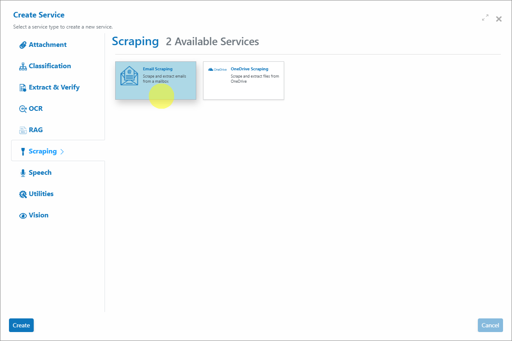

# 📧 Email Scraper

### Overview

The Email Scraper in AIForged checks configured mailboxes at scheduled intervals and imports new emails into your agent. Attachments are automatically extracted using the built‑in attachment utility, streamlining document intake and downstream automation.

!!! info
    Use the Email Scraper to centralize document intake from mailboxes and automatically extract attachments for processing by other services in your agent.

***

### Permissions Required

Members must belong to one of the following AIForged user group roles to add and configure this service:

* Owner
* Administrator
* Developer

!!! info
    Tip: Role membership is managed in Organisations > Roles. Assign members to roles to grant agent and service administration access.

***

### Supported Platforms

- **Gmail**
    - Connect to Gmail accounts using IMAP with app‑specific passwords.

- **Microsoft 365**
    - Authenticate using prompt‑less device code flow for secure mailbox integration.

- **Other Email Providers**
    - Any IMAP‑capable provider can be used with the correct settings.

***

### Possible Use Cases

* Automated intake of emailed documents (invoices, statements, forms) and attachment extraction.
* Separate scrapers per supplier, department, or folder for organized processing.
* Build hands‑off “email to workflow” pipelines across multiple tenants or mailboxes.

***

### Service Setup

Follow these steps to add and configure the Email Scraper in your agent:

1. **Open the Agent View**
    - Navigate to the agent where you want to add the service.
2. **Add the Email Scraper**
    - Click the **Add Service**  button and choose **Email Scraper** from the available service types.

    

3. **Configure the Service Wizard**
    - Open the Service Configuration Wizard.
    - Step 1: General Settings
        - Configure the settings as required. Continue reading to determine the correct configuration for your mailbox.

***

### Prompt-less Code Flow Authentication (Microsoft 365)

AIForged supports prompt‑less device code flow for Microsoft 365. After initial setup, no user interaction is required on scheduled runs.

- How it works
    - Provide your Azure AD Tenant ID and Client ID (from your Azure app registration) in the Email Scraper settings.
- Setup
    1. Register an application in your Azure AD tenant.
    2. Note the Tenant ID and Client ID.
    3. Enter both values in the Email Scraper configuration and enable Prompt‑less Code Flow.

- Operation
    - The scraper retrieves a device token automatically on its first scheduled run. On subsequent runs, it retrieves emails without prompts.

!!! info
    This is the recommended and most secure way to connect Microsoft 365 mailboxes—no stored passwords and no manual prompts after setup.

***

### Service Configuration Settings

Apply the following settings depending on your email provider. Values not listed can typically be left as defaults.

#### Microsoft 365 (Recommended)

* Service Type: IMAP
* Server: outlook.office365.com
* Port: 993
* Username: The email address to be scraped
* Password: Not required when using prompt‑less code flow
* Prompt‑less Code Flow: Yes (enable this option)
* Tenant ID: Your Azure AD tenant ID
* Client ID: Your Azure app registration client ID
* Remove XOAUTH2: No
* Folder: The mailbox folder to monitor (e.g., Inbox)
* Processed Folder: The folder where processed emails will be moved

#### Gmail

* Service Type: IMAP
* Server: imap.gmail.com
* Port: 993
* Username: The email address to be scraped
* Password: App‑specific password (required by Google for third‑party IMAP access)
* Remove XOAUTH2: Yes
* Folder: The mailbox folder to monitor (e.g., Inbox)
* Processed Folder: The folder where processed emails will be moved

#### Other Providers

* Service Type: IMAP
* Server: Provider‑specific IMAP server address
* Port: Typically 993
* Username: The email address to be scraped
* Password: Email account or app‑specific password (as required)
* Remove XOAUTH2: As required by your provider
* Folder: The mailbox folder to monitor
* Processed Folder: The folder where processed emails will be moved

***

### Enable Auto Execution

Turn on Auto Execution to run the scraper at scheduled intervals. Adjust the interval based on expected mail volume and provider throttling.

***

### View Imported Emails and Attachments

* Open the Email Scraper service to see newly retrieved emails in the grid.
* Open an email to review headers and extraction details.
* Attachments are automatically extracted and available as documents for downstream processing by other services in your agent.

***

### Known Limitations

* Provider throttling and rate limits
    * IMAP providers (including Microsoft 365 and Gmail) may throttle frequent polling or large mailbox operations.
* Authentication constraints
    * Gmail requires app‑specific passwords for IMAP access.
    * Microsoft 365 requires a correctly configured Azure app (Tenant ID and Client ID) for prompt‑less device code flow.
    * Some providers may block basic authentication or require modern auth; ensure “Remove XOAUTH2” is set appropriately.
* Mailbox and folder permissions
    * The configured account must have permission to read and move messages in the monitored and processed folders (shared mailboxes may need explicit permissions).
* Duplicate processing risk
    * If “Processed Folder” is not set or moving messages fails, messages may be re‑seen on the next run.
* Large or unusual attachments
    * Very large attachments or unusual MIME structures may increase processing time or be skipped by the provider.
* HTML‑only or malformed emails
    * Some messages may contain only HTML or malformed headers that reduce metadata extraction quality.

!!! info
    Tip: For large mailboxes, start with a narrow Folder scope and use a dedicated Processed Folder to avoid re‑processing and to keep runs fast.

***

### Troubleshooting Tips

* Not retrieving any emails?
    * Verify IMAP is enabled for the mailbox, and confirm server/port/SSL settings.
    * Check credentials or app configuration (Gmail app password, M365 Tenant ID/Client ID with prompt‑less code flow enabled).
    * Ensure Folder names are correct (case‑sensitive on some providers).
* Emails re‑processing repeatedly
    * Confirm the Processed Folder exists and that the scraper can move messages after extraction.
    * Check mailbox rules or retention policies that might move items back into the monitored folder.
* Authentication failures
    * Gmail: Use an app‑specific password and enable IMAP in account settings.
    * Microsoft 365: Confirm the Azure app registration, Tenant ID, Client ID, and permissions. Retry after enabling prompt‑less code flow.
* Attachments not extracted
    * Verify the message actually contains attachments (some links are not attachments).
    * Check attachment size limits and MIME structure; re‑send a test email with a standard PDF.
* Slow runs or timeouts
    * Reduce polling frequency or limit to a smaller Folder.
    * Archive old emails from the monitored folder to improve performance.

***

### Best Practices

* Use Microsoft 365 prompt‑less device code flow for secure, hands‑off integration.
* For Gmail, always use app‑specific passwords and enable IMAP in account settings.
* Configure a dedicated Processed Folder to prevent duplicates and keep the Inbox tidy.
* Consider separate scrapers per mailbox or per folder to isolate workflows and simplify troubleshooting.
* Start with a small interval and scale up cautiously, monitoring provider throttling and mailbox size.

***

### Quick Start

Get results in minutes:

1. Add the service
    - Open your agent, click **Add Service**, and select **Email Scraper**.
2. Configure provider settings
    - Choose Microsoft 365 (prompt‑less device code flow), Gmail, or Other IMAP and enter the required fields.
3. Enable Auto Execution
    - Turn on Auto Execution and set a reasonable interval.
4. Review imports
    - Open the Email Scraper service grid to verify that emails are retrieved and attachments are extracted.

!!! info
    Tip: Start with a single mailbox and folder, confirm correct operation, then expand to additional folders or scrapers.

***

### FAQ

* Do I need to store passwords?
    * For Microsoft 365 with prompt‑less device code flow, no passwords are stored. For Gmail and other providers, use app‑specific or provider‑approved credentials.
* Can I scrape shared mailboxes in Microsoft 365?
    * Yes, provided the configured account has permission to access the shared mailbox and folders.
* How do I prevent duplicate processing?
    * Set a Processed Folder and ensure the scraper can move messages after processing.
* Are attachments always extracted?
    * Standard attachments are extracted automatically. Extremely large or unusual MIME formats may require a test or an alternative intake path.
* Can I run multiple scrapers in one agent?
    * Yes. Use separate scrapers for different mailboxes or folders to keep workflows organized and scalable.

