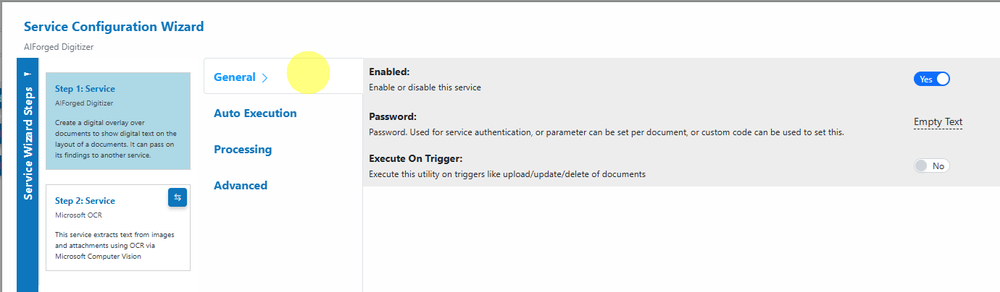
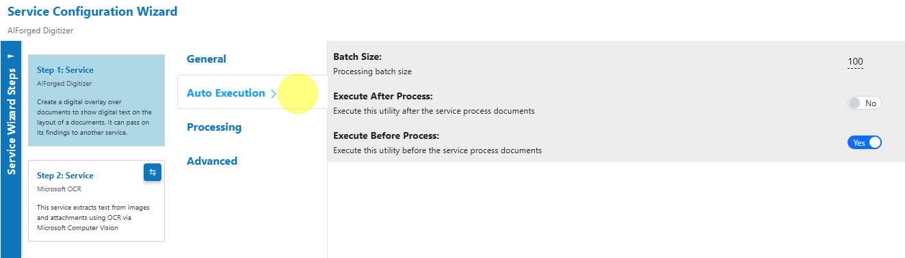
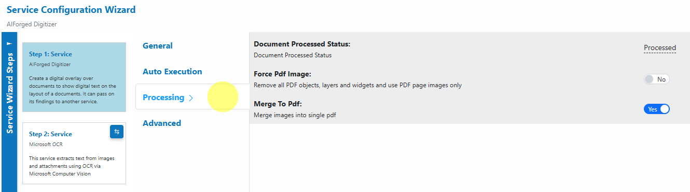
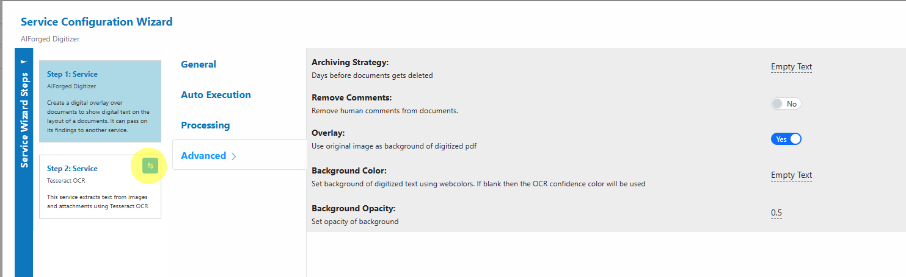

# AIForged Digitizer

## AIForged Digitizer

### Overview

The AIForged Digitizer is a utility service that converts scanned or image-based documents into searchable PDFs by adding a text layer to each page. It can also draw a visual overlay to indicate where text was detected for easier validation. The Digitizer uses a dependent OCR engine (default: Tesseract) and can be switched to another OCR (e.g., Microsoft OCR or Google OCR) in the Service Configuration Wizard if you need different language support or accuracy characteristics.


Use the Digitizer as a pre-processor to make documents searchable and consistent before downstream extraction, classification, or rules. It can also run automatically on triggers as new files arrive.


***

### Permissions Required

Members must belong to one of the following AIForged user group roles to add and configure this service:

* Owner
* Administrator
* Developer


Tip: Role membership is managed in Organisations > Roles. Assign members to roles to grant agent and service administration access.


***

### Supported Content Types

* PDF
* JPEG
* PNG
* TIFF


If your content is in a different format, use the AIForged PDF Converter to generate a compatible file.


***

### Possible Use Cases

* Convert scanned archives into searchable PDFs for faster discovery and indexing.
* Standardize inputs (mixed scans and images) before applying OCR-based extraction or Document Intelligence services.
* Produce digitized PDFs that visually indicate where text was detected for quicker review.

***

### Add as Utility (Pre-/Post-Processor)

Utility services are not configured as standalone services. Attach them to a parent service either from the parent’s service view or from the service flow configurator.

#### Option A: From Parent Service View

1. Open the parent service.
2. Click the Add Service dropdown and select Utility Service. \
   
3. Choose the utility (e.g., AIForged Digitizer, AIForged Image Splitter).
4. In the utility’s settings, specify when it should run:
   * Execute Before Process = Pre-processor
   * Execute After Process = Post-processor

#### Option B: From Service Flow Configurator

1. Open the parent service’s Service Flow Configurator.
2. Expand the Utility Service Types group.&#x20;
3. Drag the utility onto the parent service:
   * Drop to the left for Pre-processor.
   * Drop to the right for Post-processor.&#x20;
4. Save.


Utilities run as part of the parent’s lifecycle. Use Execute Before Process or Execute After Process to control the timing. Avoid configuring utility services as standalone services.


1. Configure the Service Wizard\
   The wizard includes the following sections:
   * General\
     Enable the service, set optional authentication, and decide if it should execute on triggers.\
     
   * Auto Execution\
     Configure Batch Size and whether the Digitizer should run before or after other processes.\
     
   * Processing\
     Set the post-processing document status, force PDFs to image-only if needed, and merge images into a single PDF.\
     
   * Advanced\
     Configure overlay options (use original image as background), background color/opacity, archiving, and comment removal.\
     

_The default settings are sufficient for most use cases. Only adjust advanced options if you have specific workflow or integration requirements._


Step 2 in the wizard shows the dependent OCR service (default: Tesseract). You can change this to Microsoft OCR or Google OCR if required.


***

### Service Configuration Settings

Most users can proceed with defaults. The following settings map to the wizard tabs shown above:

* General
  * Enabled: Turn the service on or off.
  * Password: Used for service authentication; can be set per document via Custom Code.
  * Execute On Trigger: Execute on upload/update/delete of documents (ideal for automated pre-processing).
* Auto Execution
  * Batch Size: Processing batch size per run.
  * Execute After Process: Run this utility after the parent service processes documents.
  * Execute Before Process: Run this utility before the parent service processes documents.
* Processing
  * Document Processed Status: Status applied after digitization (e.g., Processed).
  * Force Pdf Image: Remove PDF objects, layers, and widgets; use page images only (helps ensure consistent OCR).
  * Merge To Pdf: Merge multiple images into a single PDF.
* Advanced
  * Archiving Strategy: Days before documents get deleted.
  * Remove Comments: Remove human comments from documents.
  * Overlay: Use original image as the background of the digitized PDF (visual context).
  * Background Color: Web color for the digitized text background; if blank, OCR confidence color is used.
  * Background Opacity: Opacity of the background (e.g., 0.5).
* Dependent OCR (Step 2: Service)
  * Choose the OCR engine used by the Digitizer (default: Tesseract). Switch to Microsoft or Google OCR if you need different language coverage or accuracy.


If the default Tesseract engine does not produce the expected results, switch the dependent OCR to Microsoft OCR or Google OCR in Step 2 and set a suitable Language hint.


***

### Add and Process Documents

To digitize documents using the AIForged Digitizer:

1. Open Service\
   When you open the AIForged Digitizer, you will be presented with the documents currently queued or processed in the Inbox.
2. Upload Documents\
   Click the Upload  button or drag and drop files over the document grid.\

3. Select Category (Optional)\
   If you know the category for the document, select it. Otherwise, select **No category**.
4. Process Documents\
   After uploading, select the documents to process and click Process Checked.


Tip: For new services, process a small batch first to verify the digitized output and ensure downstream services receive what they need.


***

### View Processed Documents

* Select Outbox in the usage filter in the AIForged Digitizer.\
  
* Open a processed document to preview the digitized output. The resulting PDF contains a selectable text layer and, if enabled, a visual overlay.
* Download the digitized PDF if needed for external systems.

***

### Troubleshooting Tips

* Missing or incorrect text
  * Improve scan quality (aim for 300 DPI), deskew, and reduce noise.
  * Set a Language hint appropriate to the document.
  * If the PDF is electronic with an existing text layer, the original may already be searchable.
* Overlay looks too light or too dark
  * Adjust Background Color and Background Opacity in Advanced to improve readability.
  * If the source image is very busy, consider disabling Overlay for a cleaner text layer.
* Output is empty for a protected PDF
  * Provide the password via Custom Code pre-processing so AIForged can unlock the file before digitization.
* Performance issues on large files
  * Split the document into smaller parts with the Document Splitter and process in smaller batches.
* Dependent OCR not meeting expectations
  * Switch the OCR engine in Step 2 (e.g., from Tesseract to Microsoft OCR) and retest a small batch.

***

### Best Practices

* Scan at 300 DPI or higher with good contrast; avoid shadows and skew for photos or mobile captures.
* Provide a Language hint for non-English documents to improve recognition.
* Use the Digitizer as a pre-processor ahead of extraction, classification, or rules to ensure consistent, searchable inputs.
* Start with a pilot set to validate output, then scale; tune dependent OCR, overlay, and batching as needed.
* For very large or multi-volume archives, use Execute On Trigger and schedule Auto Execution to spread the load.

 IgnoreCase Multiline IgnoreCase Multiline

