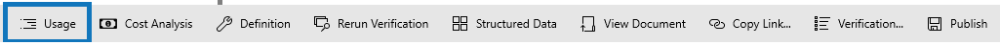
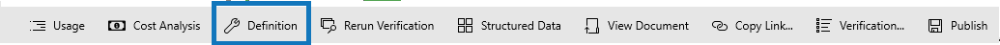
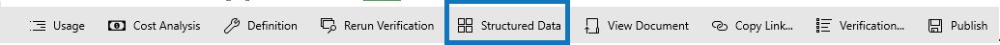
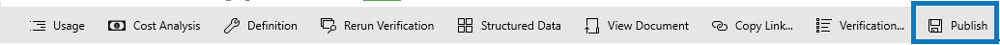

# Document Verification

## Usage

1.Click on any of the tags
2.Click on the "Usage" command in the command bar
3.This will open up the usage page you can view the usage page [Here](verification/document-analytics.md)

## Cost Analysis

* The "Cost Analysis" Command takes you to the Analytics page [Todo]

## Definition

* The "Definition" Command takes you to the Cost Analysis page [Todo]

## Rerun Verification

* The "Rerun Verification" Command takes you to the Cost Analysis page [Todo]

## Structured Data

* The "Structured Data" Command takes you to the Cost Analysis page [Todo]

## View Document

* The "View Document" Command takes you to the Cost Analysis page [Todo]

## Copy Link

* The "Copy Link" Command takes you to the Cost Analysis page [Todo]

## verification

* The "Verification" Command takes you to the Cost Analysis page [Todo]

## Publish

* The "Publish" Command allows you to publiish changes made[Todo]